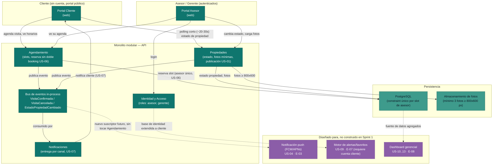

# Arquitectura — Delivery `inmobiliaria-azuay`

> Generado por el Architect a partir de `inbox/` y de los outputs ya generados
> (`epics.md`, `backlog.json`, `stories.md`, `sprint-plan.md`). Cubre lo mínimo
> necesario para el Sprint 1 comprometido y deja diseñado — sin construir — el
> punto de extensión para las épicas de mayor prioridad que siguen (E-03, E-04),
> tal como exige el Sprint Goal: *"El cliente ve el estado real de las
> propiedades y agenda su visita 100% desde el portal, sin depender del
> teléfono."*

---

## 1. Alcance de esta arquitectura

Sprint 1 comprometió (`sprint-plan.md`, 19/20 pts):

| Historia | Épica | Pts | Qué fuerza técnicamente |
|---|---|---|---|
| US-05 | E-01 | 5 | Estado de propiedad visible casi en tiempo real (latencia < 60 s, R-05/R-14) |
| US-06 | E-02 | 8 | Agendamiento sin doble reserva, un único asesor por propiedad |
| US-07 | E-01 | 3 | Notificación proactiva al cliente si cambia el estado tras agendar (depende de US-06) |
| US-01 | E-05 | 3 | Publicación de propiedad en un clic al recibir las fotos mínimas |

Las épicas de **mayor prioridad conocida que vienen después** y que esta
arquitectura no debe bloquear:

- **E-03 · Asesor preparado a tiempo** (US-04, 5 pts, prioridad 3, dependiente de
  US-06): notificación push al asesor cuando se confirma/cancela una visita.
  Quedó fuera del Sprint 1 solo por capacidad (`sprint-plan.md`), no por
  dependencia técnica sin resolver.
- **E-04 · Historial unificado del cliente** (US-03, 5 pts, prioridad 4): vista
  agregada de visitas, ofertas y consultas por cliente.

Fuera de foco explícito por ahora (no hay fuerza del inbox que obligue a
diseñar para esto hoy): E-06 (rechazo de ofertas), E-07 (alertas/favoritos —
requiere identidad de cliente persistente, ver ADR-0005), E-08 (dashboard
gerencial — el propio `mvp-canvas.md` dice que "sin adopción operativa es
datos vacíos").

---

## 2. Diagrama de componentes

**Leyenda:** teal = construido en Sprint 1 · teal claro = persistencia · morado
punteado = diseñado como punto de extensión pero **no** implementado todavía
(depende de historias que aún no entraron al sprint).

---

## 3. Por qué esta estructura (valor y simplicidad)

**Monolito modular, no microservicios.** El Sprint 1 son 19 pts con un equipo
que atiende a 4 asesores (`personas.md`); no hay evidencia en el inbox de
necesidad de escalar o desplegar componentes por separado. Separar por
**módulos de dominio** dentro de un mismo proceso (Propiedades, Agendamiento,
Notificaciones, Identidad) da el beneficio real que sí hace falta —que
Agendamiento no dependa del detalle de cómo se notifica, para no bloquear
US-04/E-03 después— sin pagar el costo operativo de servicios distribuidos que
nadie pidió todavía. Ver ADR-0001.

**Polling corto, no WebSockets/SSE, para el estado en tiempo real (US-05).**
El requisito es explícito y generoso: latencia **< 60 s** (R-14), no
"instantáneo". Con el volumen de esta inmobiliaria (Cuenca, 4 asesores), un
polling de 20-30 s desde el portal cumple el requisito con la infraestructura
más simple posible (HTTP sin estado, ya presente). Ver ADR-0002.

**Restricción única en base de datos + transacción para evitar doble reserva
(US-06).** Es la fuerza más crítica del sprint: si el propio sistema permite
doble reserva, reproduce exactamente el dolor que el MVP existe para
eliminar (visita en vano). Se resuelve con el mecanismo más simple y
verificable —constraint relacional— antes de considerar colas o locks
distribuidos que el volumen actual no justifica. Ver ADR-0003.

**Eventos de dominio in-process para notificaciones, no acoplamiento directo.**
`stories.md` ya deja escrito en el criterio de aceptación de US-06 que "el
asesor recibe la notificación (US-04)", aunque US-04 no entró a este sprint
por capacidad. Diseñar el punto de publicación de eventos ahora —aunque solo
se implemente el consumidor de US-07 este sprint— es lo que evita que E-03
obligue a reabrir el módulo de Agendamiento después. Esto es exactamente "lo
mínimo que no bloquea lo que sigue", no sobre-ingeniería: no se construye un
broker externo, solo el punto de costura dentro del mismo proceso. Ver
ADR-0004.

**Identidad solo para staff, cliente sin cuenta.** Ninguna historia
comprometida (US-05, US-06, US-07, US-01) exige que el cliente se registre;
exigirlo introduciría la misma fricción telefónica que el MVP busca eliminar,
solo que con un formulario de registro en su lugar. Se difiere la identidad
persistente de cliente hasta que una historia real la necesite (US-09/E-07).
Ver ADR-0005.

---

## 4. Qué se decide explícitamente NO hacer todavía (deferred / open questions)

- **Broker de mensajería externo (Kafka/RabbitMQ/SQS):** el bus de eventos es
  in-process. Se reconsiderará solo si aparecen múltiples consumidores async
  de alto volumen o necesidad de desplegar Notificaciones por separado —
  ninguna evidencia de eso en el inbox hoy.
- **WebSockets/SSE para tiempo real:** el requisito de latencia (< 60 s) no lo
  exige. Abierto para revisar si una historia futura (p. ej. alertas de E-07)
  pide push real.
- **Notificación push real (FCM/APNs) para el asesor:** el bus ya deja el
  punto de extensión listo (ver diagrama), pero la implementación del canal
  push es responsabilidad de US-04 cuando entre al sprint — no se construye
  ahora porque no está comprometida.
- **Canal exacto de la notificación al cliente (US-07):** el inbox no
  especifica si es push, email o in-app; se asume notificación in-app + email
  como la opción más simple sin infraestructura de push móvil, y se declara
  como supuesto explícito, no un hecho confirmado por el inbox.
- **Identidad/cuenta persistente de cliente:** diferida hasta que E-07
  (alertas y favoritos, US-09) se priorice; hoy no hay historia comprometida
  que la requiera.
- **Cualquier componente de E-08 (dashboard gerencial):** el propio
  `mvp-canvas.md` advierte que "sin adopción operativa es datos vacíos"; no se
  diseña infraestructura de agregación/analítica todavía.
- **Selección de proveedor de almacenamiento de fotos (S3 vs. local vs. otro
  proveedor):** el inbox no lo especifica; se deja como interfaz de
  almacenamiento de objetos sin comprometer un proveedor concreto.

---

## 5. ADRs relacionados

- `adr/ADR-0001-monolito-modular-por-dominios.md`
- `adr/ADR-0002-estado-tiempo-real-via-polling.md`
- `adr/ADR-0003-consistencia-agendamiento-constraint-unico.md`
- `adr/ADR-0004-eventos-dominio-para-notificaciones.md`
- `adr/ADR-0005-identidad-staff-cliente-sin-cuenta.md`
