# Épicas — Delivery `citasalud`

> Generado por el Product Owner a partir de `inbox/` (única fuente de verdad).
> Nota de trazabilidad: el contenido real recibido en `inbox/mvp-canvas.md`,
> `user-stories.md`, `requisitos.md`, `personas.md` y `evidence-map.json` corresponde
> al discovery **"inmobiliaria-azuay"** (plataforma inmobiliaria), no a un dominio de
> citas médicas. No se inventó contenido de "CitaSalud": este documento respeta
> exactamente lo que hay en el inbox de esta carpeta.

---

## E-01 · Menos visitas en vano por información confiable y en tiempo real
**Valor (outcome):** El cliente deja de perder tiempo visitando propiedades que ya no
están disponibles o que no cumplen la información mínima que necesita para decidir;
aumenta su confianza en el portal.
**Origen:** `mvp-canvas.md` (funcionalidades "Estado en tiempo real", "Ficha con
mínimos obligatorios", "Notificación proactiva al cliente"; riesgo #2) ·
`requisitos.md` R-05, R-06, R-08, R-14, R-15 · `personas.md` dolores
`estado-propiedad-no-real-time`, `visita-sin-aviso-de-reserva`,
`informacion-incompleta-y-engañosa`
**Prioridad:** 1
**Historias:** US-05, US-07, US-08
**Por qué va primero:** Es el dolor más visceral y mejor evidenciado del discovery
(el cliente hizo una visita de 40 minutos a una propiedad que ya estaba reservada) y
la base de confianza sin la cual ningún otro output del MVP genera valor real.

---

## E-02 · Agendamiento sin depender del teléfono
**Valor (outcome):** El cliente reserva su visita 100 % desde el portal sin llamar
ni esperar un callback, atacando directamente el cuello de botella telefónico.
**Origen:** `mvp-canvas.md` (funcionalidad "Agendamiento online"; métrica de éxito:
"≥ 70 % de visitas agendadas por portal en 60 días") · `requisitos.md` R-07 ·
`personas.md` dolor `agendamiento-visita-por-telefono`
**Prioridad:** 2
**Historias:** US-06
**Por qué va acá:** Es la única métrica de éxito explícita del `mvp-canvas.md`; sin
esta épica no hay forma de medir si el MVP está funcionando.

---

## E-03 · El asesor llega preparado y a tiempo a cada visita
**Valor (outcome):** El asesor se entera al instante de cada confirmación o
cancelación de visita y llega preparado, cerrando el circuito entre el cliente
autogestionado y el asesor en terreno.
**Origen:** `mvp-canvas.md` (funcionalidad "Notificación push al asesor") ·
`requisitos.md` R-04 · `personas.md` dolor `notificaciones-visitas-tardias`
**Prioridad:** 3
**Historias:** US-04
**Por qué va acá:** Completa de punta a punta el outcome del MVP (cliente agenda
solo → asesor se entera y llega preparado); sin ella, E-01 y E-02 mueven al cliente
pero dejan ciego al asesor.

---

## E-04 · Historial unificado del cliente para el asesor
**Valor (outcome):** El asesor entra a cada reunión con el historial completo del
cliente (visitas, ofertas, consultas) en un solo lugar, sin pedirle que repita
información.
**Origen:** `user-stories.md` US-03 (fuera del MVP) · `requisitos.md` R-03 ·
`personas.md` dolor `historial-cliente-disperso`
**Prioridad:** 4
**Historias:** US-03
**Por qué va acá:** Mejora la eficiencia del asesor sobre un flujo ya habilitado
por el MVP, pero no bloquea la operación diaria como sí lo hacen E-01/E-02/E-03.

---

## E-05 · Publicación rápida al recibir las fotos de la propiedad
**Valor (outcome):** El asesor no pierde la oportunidad de publicar una propiedad
solo porque el dueño demora en enviar las fotos: se activa con un clic en cuanto
llegan las imágenes mínimas.
**Origen:** `user-stories.md` US-01 (fuera del MVP) · `requisitos.md` R-01 ·
`personas.md` dolor `fotos-pendientes-bloquean-publicacion`
**Prioridad:** 5
**Historias:** US-01
**Por qué va acá:** Ataca una pérdida real de oportunidades de venta, pero es un
problema de flujo interno del asesor con el dueño, no del cliente final; puede
esperar a que el MVP esté adoptado.

---

## E-06 · Rechazo automático de ofertas bajo el mínimo
**Valor (outcome):** El sistema filtra automáticamente las ofertas por debajo del
precio mínimo pactado, evitando conversaciones incómodas para el asesor.
**Origen:** `mvp-canvas.md` (sección "Fuera de alcance — detalle": "el asesor ya
tiene el portal y las notificaciones como cambio de fondo... este puede esperar") ·
`user-stories.md` US-02 · `requisitos.md` R-02 · `personas.md` dolor
`ofertas-bajo-minimo-sin-filtro`
**Prioridad:** 6
**Historias:** US-02
**Por qué va acá:** El propio `mvp-canvas.md` lo marca explícitamente como algo
que "puede esperar" porque el asesor ya recibe alivio operativo con el resto del MVP.

---

## E-07 · Alertas proactivas de precio y nuevas propiedades para el cliente
**Valor (outcome):** El cliente recibe alertas de baja de precio o de nuevas
propiedades que calzan sus criterios, sin tener que revisar el portal a diario.
**Origen:** `mvp-canvas.md` (sección "Fuera de alcance — detalle": "se construye
sobre la adopción del agendamiento, no antes") · `user-stories.md` US-09 ·
`requisitos.md` R-09
**Prioridad:** 7
**Historias:** US-09
**Por qué va acá:** El propio `mvp-canvas.md` advierte que depende de que el
cliente ya confíe y adopte el agendamiento (E-02); construirla antes sería
apostar sobre una base no validada.

---

## E-08 · Visibilidad operativa para la gerencia
**Valor (outcome):** La gerente obtiene visibilidad del rendimiento por asesor, la
carga de clientes, las propiedades inactivas y las ofertas rechazadas, para tomar
decisiones de gestión y de precio.
**Origen:** `mvp-canvas.md` (sección "Fuera de alcance — detalle": "sin adopción
operativa, el dashboard es datos vacíos") · `user-stories.md` US-10, US-11, US-12,
US-13 · `requisitos.md` R-10, R-11, R-12, R-13 · `personas.md` dolores
`visibilidad-rendimiento-asesores`, `asignacion-clientes-sin-vista-de-carga`,
`propiedades-inactivas-sin-alerta`, `ofertas-rechazadas-sin-consolidar`
**Prioridad:** 8
**Historias:** US-10, US-11, US-12, US-13
**Por qué va último:** El `mvp-canvas.md` es explícito: sin adopción operativa del
resto del backlog no hay datos que mostrar en este dashboard; es la épica más
dependiente de todas las demás.

---

## Diagrama del backlog (épicas → historias candidatas)

```mermaid
flowchart TD
  classDef epic fill:#0F766E,color:#fff,stroke:#0A5750;
  classDef ready fill:#3E9B8C,color:#0E1A26,stroke:#0A5750;
  classDef review fill:#8B5DA8,color:#fff,stroke:#6A3D86;

  E1["E-01 · Menos visitas en vano"]:::epic
  E2["E-02 · Agendamiento sin teléfono"]:::epic
  E3["E-03 · Asesor preparado a tiempo"]:::epic
  E4["E-04 · Historial unificado del cliente"]:::epic
  E5["E-05 · Publicación rápida al recibir fotos"]:::epic
  E6["E-06 · Rechazo automático de ofertas"]:::epic
  E7["E-07 · Alertas de precio y propiedades"]:::epic
  E8["E-08 · Visibilidad operativa para la gerencia"]:::epic

  E1 --> US05["US-05 · Estado en tiempo real"]:::ready
  E1 --> US07["US-07 · Notificación proactiva al cliente"]:::ready
  E1 --> US08["US-08 · Ficha con mínimos obligatorios"]:::review

  E2 --> US06["US-06 · Agendamiento online"]:::review

  E3 --> US04["US-04 · Notificación push al asesor"]:::ready

  E4 --> US03["US-03 · Historial unificado del cliente"]:::review

  E5 --> US01["US-01 · Publicación rápida al recibir fotos"]:::ready

  E6 --> US02["US-02 · Rechazo automático de ofertas"]:::review

  E7 --> US09["US-09 · Alertas de precio y propiedades"]:::ready

  E8 --> US10["US-10 · Resumen de rendimiento por asesor"]:::ready
  E8 --> US11["US-11 · Vista de carga de asesores"]:::ready
  E8 --> US12["US-12 · Alerta de propiedades sin actividad"]:::review
  E8 --> US13["US-13 · Consolidado de ofertas rechazadas"]:::review
```

**Leyenda:** teal = épica · verde/teal claro = historia candidata sin preguntas
abiertas pendientes · morado = historia candidata que necesita refinamiento
(tiene al menos una pregunta abierta que resolverá `generate-stories` antes de
pasar el gate DoR/INVEST).

---

## Preguntas abiertas heredadas al backlog

Estas preguntas viven en `backlog.json` bajo cada historia (`open_questions`); no
se afirmó nada sobre ellas porque el inbox no las respalda:

- **US-06:** ¿el cliente elige el asesor asignado o el sistema lo asigna
  automáticamente cuando hay varios asesores para la misma propiedad?
- **US-08:** ¿qué validación determina "fotos de calidad" más allá de la
  resolución mínima (≥ 800×600 px)? ¿hay revisión manual o solo automática?
- **US-03:** ¿el historial debe actualizarse en tiempo real (push) o basta con
  actualización al recargar la vista?
- **US-02:** ¿el precio mínimo pactado es un campo obligatorio de la ficha de
  propiedad o se gestiona en un módulo aparte?
- **US-12:** ¿el umbral configurable de semanas sin actividad es global para toda
  la inmobiliaria o configurable por tipo de propiedad/asesor?
- **US-13:** ¿el umbral de tres o más rechazos es una regla de negocio fija o
  solo un valor ilustrativo del criterio de aceptación?
